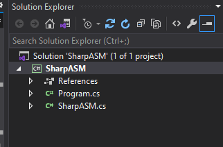
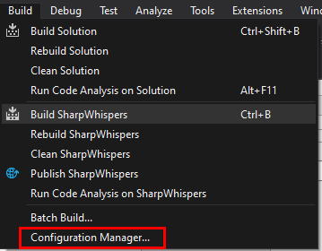
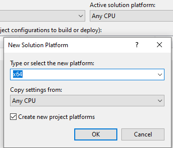
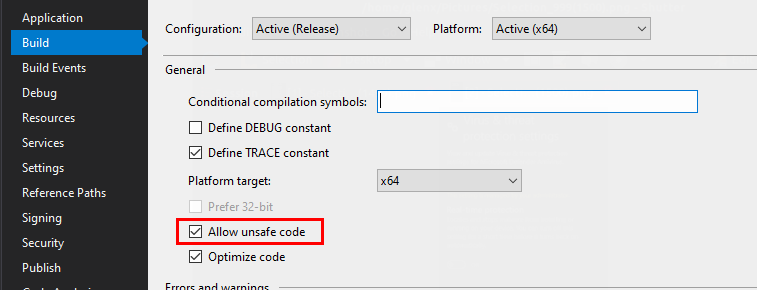
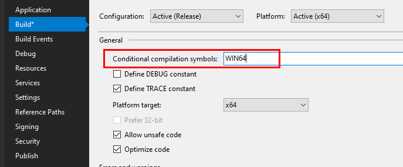
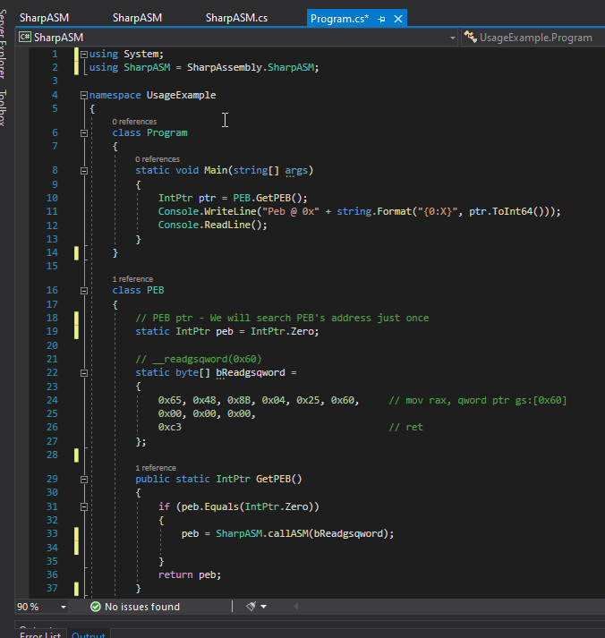

# Visual Studio Project

## Create a *.Net Framework* Project

## Add SharpASM.cs to the project

## (Optional) Create two build configuration to handle x86 and x86-64

### Go on `Build` --> `Configuration Manager`

### Open the drop down menu `Active solution platform` and click on `New`

### Create the configuration

## Enable unsafe code

Pick `Allow unsafe code` in the project `Build` configuration

## Define conditional compilation symbol (only 64 bit)

## Write your program using SharpASM

